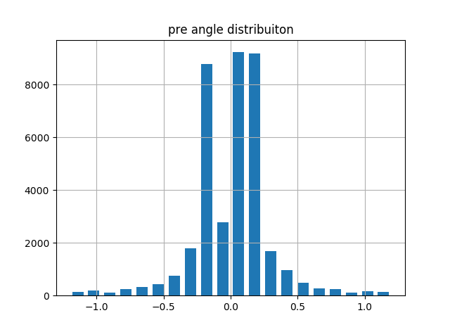
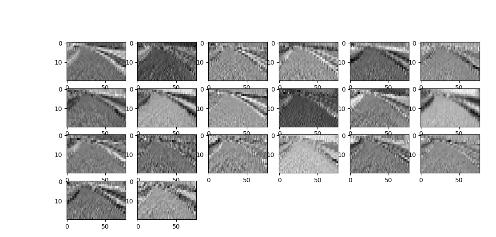

#Udacity:Self-Driving Car NanoDegree-Behaviorial Cloning Project

#Project Goals
---
The goals / steps of this project are the following:
* Use the simulator to collect data of good driving behavior 
* Design, train and validate a model that predicts a steering angle from image data
* Use the model to drive the vehicle autonomously around the first track in the simulator. The vehicle should remain on the road for an entire loop around the track.
* Summarize the results with a written report.

#Overview
---
This project involves training a deep neural network by collecting data generated by a simulated driving around tracks (using a simulator) and use the trained model to drive the vehicle in autonomous mode. This is akin to teaching a vehicle to drive autonomously.So, the goal is to train a deep neural network using your (or other's) driving behavior and let it "clone" that driving behavioral in autonomous mode.

Two tracks are provided in the simulator, "test track" and "challenge track". The challenge tracks has quite a lot of twist and turns.

The training data is images from 3 cameras on the vehicles dash, left,center and right along with steering angle, throttle, brake, and speed. A convolution network is used to model the behavioral learning. Keras is package is used to model the CNN.

The data collected is a combination of example data provided by udacity and generated by me by running the vehicle in training mode on the simulator. the trained model is run in simulator in autonomous mode using drive.py script that comes along with the project repository.

**The steps followed during this project are:**

* Analyze raw data set collected by driving vehicle on test track and data from udacity.
* Augment dataset.
* Setup model for training (lenet/nvidia architectures)
* Tune model hyper parameters with few samples from dataset (does model overfit.)
* Add samples and retrain.
* Run simulator in autonomous mode with drive.py.

#Dataset Analysis
----
The dataset has a high bias of 0 degree steering angle. Intuitively, since the test track has many long straight lines stretches, the zero angle data makes sense to be used most often in training. During first few iterations of trainign and testing the vehicles kept going straight on some  curves while navigated successfully other turns.I augmented the training data with sharp turns but 1 turn still kept failing.
Later, I decided on discarding, randomly, samples with low steering angles such that ratio of larger steering angles to smaller steering angle is about 0.5x. This approach reduces training dataset but avoids bias.
Here is Raw data histogram 

*Raw Data Histogram with angle correction for left and right cams*

**The data distribution after sampling:**

*Sampled Data Histogram*

**#Only the data collected locally is uploaded to git repo**

#Augmenting data

**Following augmentation methods are used:**

1. use all camers images with steering angle correction
2. pixel intensity manupulation,
3. affine translation i.e. shift image horizontal few pixels and apply a correction factor to steering angle
4. flipping image horizontally and inverting steering angle
5. drive reverse lap and collect samples for recovery from sharp turns at track boundaries

Here are sample of data augmentations applied (the first image is base image with steering angle drawn in green color):

* Augmentation1 *

Another set of augmentation examples:
* Augmentation2 *

#Model Architecture and Training Strategy
---
The first experiments were with modified Lenet architecture, and switched to nVidia architecture after few tuning steps since vehicles kept going over track edges.

[nVidia-End to End Learning for Selfdriving Cars](https://images.nvidia.com/content/tegra/automotive/images/2016/solutions/pdf/end-to-end-dl-using-px.pdf)

*nVidia model architecture*

Keras lambda layer is used to normalize and mean-center the data.Then 3 5x5 convolution layers followed by 2 3x3 convolution layers, and 3 FC layers as hidden layers is implemented and output layer has 1 label.

YUV color scheme was tried but drive.py kept crashing during autonomous mode,so, I switched to RGB scheme. relu and ELU activation was tried. ELU performed better so that is the activation function used in the submission model.The Adam optimizer is used with learning rate of 0.0001. learning rate of 0.001 gives faster convergence (training loss saturates at around 6th epoch, however, the model doesn't perform well on challenge track).Mean squared error (mse) loss function is applied at the output. After few trials, BatcNormalization layer was added to each conv/FC layer. Dropout was tried as well to avoid overfitting but didn't seem to add much to loss/accuracy, l2 regularization with regularization parameter as 0.001 is used instead.

The image contains scenery instead of tracks on the top section and vehicle's hood at  the bottom so the images were cropped from top and bottom before passing to the model.

The basic dataset consisted of three camera images with corresponding steering angles (adjusted by -/+0.2 to -/+ 0.3 range for right and left cams and finally settled at 0.2). Samples are mix of data provided by udacity project as well as collected by me driving the vehicle on test and challenge track. This provided total of about 33,000 samples (udacity data+1 fwd lap+1 reverse lap + 1 recovery training lap+ 1 lap on mountain challenge track).The training is based on about 17,000 of the above samples and 20 epochs with learning rate of 0.0001

The first augmentation idea was to add flipped images and invert the angles. This would simply double the dataset size, however, I decided to use flipped images only for samples where the steering angles were greater than 0.25, this added samples on low sample count bins.
The next augmentations were to generalize and avoid overfitting in the model by randomly changing brightness,randomly shifting the images by few pixels and histogram equalization of color scheme.
Another idea was to add a small uniform random shift to steering angles to account for measurement noise but this being an ideal track measurement conditions, the idea was not implemented.Changing pixel brightness can probably be considered adding noise to system.
The augmentations were added successively after training and testing the model.
After a few trials, the dataset was calibrated to represent evenly different bins.This though reduced training dataset size but model was more robust.

The training of the model was done on aws gpu instance and image in drive.py was adjusted to match input layer of the model.

#Implementation of generators
---
While i was able to work with lenet without generators, once i started to try nvidia arch, model.fit proved difficult to handle in terms of memory requirement. Python generators along with keras fit_generator was implemented.
dataset was split into training and validation datsets, then shuffled and a batch size of 128 was used to generate batches of data. Each batch when passed to training model has random application of pixel intensity,horizontal translattion as well as image flip during batch generation.The above transforms are not applied to validation dataset.

#Making sense of what's going on under the Hood
---
I was curious about the features that network is learning so implemented a visualization scheme based on keras function (borrowed from guthub)[Keras resources](https://github.com/fchollet/keras-resources) for the convolution layers.
Here is a plot of the features learned by first and second layer in the model.

**Image of features in conv Layer 1**

*Layer 1 conv*

**Image of features in conv Layer 2**

*Layer 2 conv*

#Submission
---
**The following files are uploaded to this repository:**

1. model.py   --> implementation of the model
2. model.h5   --> trained model
3. drive.py   --> backend script for loading and controlling (predicting) drive behavior in simulator
4. track1.mp4  --> autonomous mode driving on track1 using model.h5 model

#Result discussion and Additional Thoughts
---
The vehicle is able to successfully run the test track autonomously. It goes about 2/3rd on the mountain track, however, at one of the uphill/downhill turns vehicles stops in the middle of the track.
This was a great project and exercised most of the concepts learned during the course about Neural Nets.
I wasn't able to implement couple fo interesting ideas such as resizing images (it would reduce training time), nVidia paper uses image size of 66x200 and YUV scale and shadow augmentation as mentioned in [this webpage](https://chatbotslife.com/learning-human-driving-behavior-using-nvidias-neural-network-model-and-image-augmentation-80399360efee)
There are also other network architectures such as comma.ai that would be fun to try.
Data analysis was the most important factor in building and training the network.

